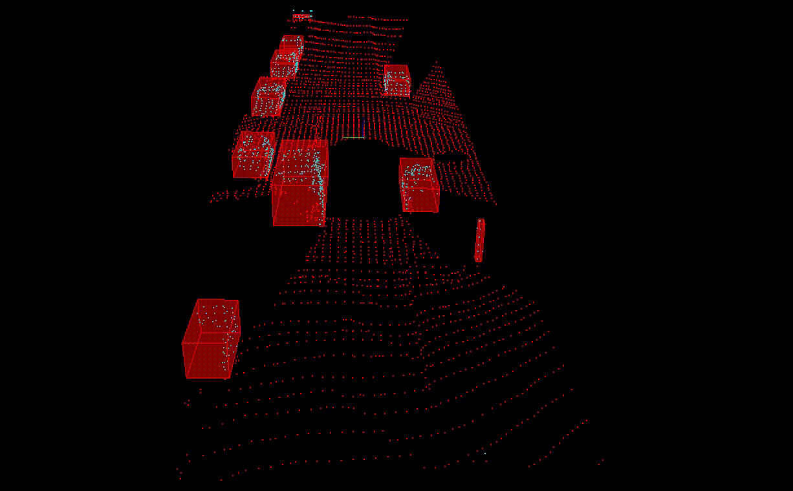

# Sensor Fusion Self-Driving Car Course
This is the first project in the Udacity Sensor Fusion Nanodegree. It consists of solving the following problem:

- Pointcloud processing with the help of PLC functions
- Understanding and deploying an implementation of RANSAC for ground segmentation
- Understanding and deploying the KD tree structure for the purpose of Euclidean distance clustering for the identification of key elements on the road

## Visulisation of final project results


## Local Installation

### Ubuntu

1. Clone this github repo:

   ```sh
   cd ~
   git clone https://github.com/udacity/SFND_Lidar_Obstacle_Detection.git
   ```

2.  Edit [CMakeLists.txt](https://github.com/udacity/SFND_Lidar_Obstacle_Detection/blob/master/CMakeLists.txt) as follows:

   ```cmake
   cmake_minimum_required(VERSION 2.8 FATAL_ERROR)

   add_definitions(-std=c++14)

   set(CXX_FLAGS "-Wall")
   set(CMAKE_CXX_FLAGS, "${CXX_FLAGS}")

   project(playback)

   find_package(PCL 1.11 REQUIRED)

   include_directories(${PCL_INCLUDE_DIRS})
   link_directories(${PCL_LIBRARY_DIRS})
   add_definitions(${PCL_DEFINITIONS})
   list(REMOVE_ITEM PCL_LIBRARIES "vtkproj4")


   add_executable (environment src/environment.cpp src/render/render.cpp src/processPointClouds.cpp)
   target_link_libraries (environment ${PCL_LIBRARIES})
   ```

3. Execute the following commands in a terminal
**Note** The [[CMakeLists.txt](https://github.com/udacity/SFND_Lidar_Obstacle_Detection/blob/master/CMakeLists.txt)] file provided in this repo can be used locally if you have the same package versions as mentioned above. If you want to run this project locally (outside the Udacity workspace), please follow the steps under the **Local Installation** section.
**Note** The [[CMakeLists.txt](https://github.com/udacity/SFND_Lidar_Obstacle_Detection/blob/master/CMakeLists.txt)] file provided in this repo can be used locally if you have the same package versions as mentioned above. If you want to run this project locally (outside the Udacity workspace), please follow the steps under the **Local Installation** section.
**Note** The [[CMakeLists.txt](https://github.com/udacity/SFND_Lidar_Obstacle_Detection/blob/master/CMakeLists.txt)] file provided in this repo can be used locally if you have the same package versions as mentioned above. If you want to run this project locally (outside the Udacity workspace), please follow the steps under the **Local Installation** section.
**Note** The [[CMakeLists.txt](https://github.com/udacity/SFND_Lidar_Obstacle_Detection/blob/master/CMakeLists.txt)] file provided in this repo can be used locally if you have the same package versions as mentioned above. If you want to run this project locally (outside the Udacity workspace), please follow the steps under the **Local Installation** section.

   ```shell
   sudo apt install libpcl-dev
   cd ~/SFND_Lidar_Obstacle_Detection
   mkdir build && cd build
   cmake ..
   make
   ./environment
   ```

   This should install the latest version of PCL. You should be able to do all the classroom exercises and project with this setup.

### MAC

#### Install via Homebrew
1. install [homebrew](https://brew.sh/)
2. update homebrew
	```bash
	$> brew update
	```
3. add  homebrew science [tap](https://docs.brew.sh/Taps)
	```bash
	$> brew tap brewsci/science
	```
4. view pcl install options
	```bash
	$> brew options pcl
	```
5. install PCL
	```bash
	$> brew install pcl
	```

6. Clone this github repo

   ```shell
   cd ~
   git clone https://github.com/udacity/SFND_Lidar_Obstacle_Detection.git
   ```

7. Edit the CMakeLists.txt file as shown in Step 2 of Ubuntu installation instructions above.

8. Execute the following commands in a terminal

   ```shell
   cd ~/SFND_Lidar_Obstacle_Detection
   mkdir build && cd build
   cmake ..
   make
   ./environment
   ```

### WINDOWS

#### Install via cvpkg

1. Follow the steps [here](https://pointclouds.org/downloads/) to install PCL.

2. Clone this github repo

   ```shell
   cd ~
   git clone https://github.com/udacity/SFND_Lidar_Obstacle_Detection.git
   ```

3. Edit the CMakeLists.txt file as shown in Step 2 of Ubuntu installation instructions above.

4. Execute the following commands in Powershell or Terminal

   ```shell
   cd ~/SFND_Lidar_Obstacle_Detection
   mkdir build && cd build
   cmake ..
   make
   ./environment
   ```

#### Build from Source

[PCL Source Github](https://github.com/PointCloudLibrary/pcl)

[PCL Mac Compilation Docs](https://pcl.readthedocs.io/projects/tutorials/en/latest/compiling_pcl_macosx.html#compiling-pcl-macosx)
